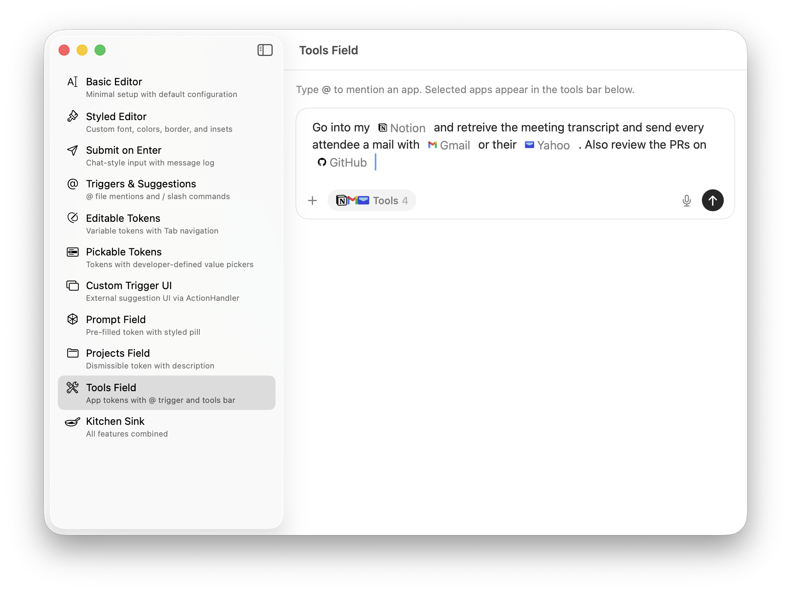
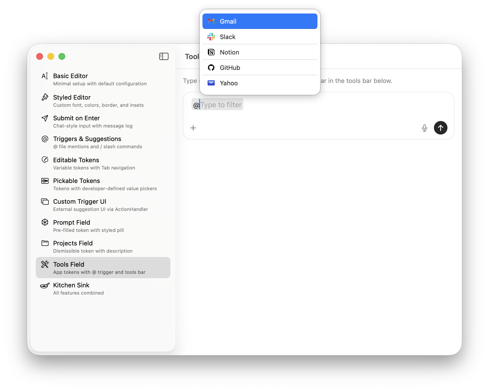
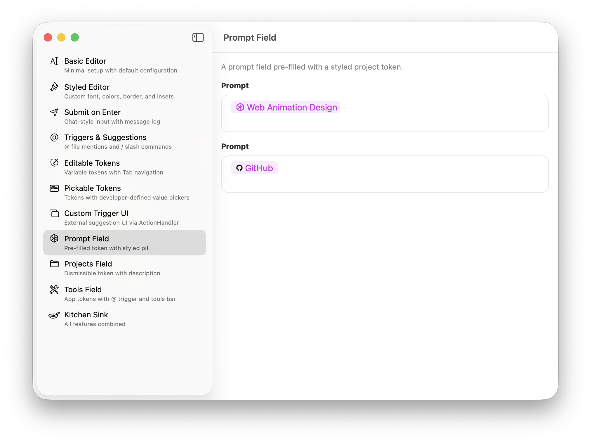

# TokenInputField

A native macOS token input editor built with AppKit (TextKit 2) and wrapped for SwiftUI. Supports inline tokens, a floating suggestion panel, editable variable tokens, and a structured document model.

## Screenshots

| Inline Tokens | Suggestion Panel |
|:---:|:---:|
|  |  |

| Editable Tokens | Prompt Field |
|:---:|:---:|
|  |  |

## Features

- **Inline tokens** rendered as pill-shaped attachments — atomic selection, backspace-to-delete, arrow-key skip
- **Four token kinds** — `.standard` (read-only), `.editable` (click-to-edit with Tab navigation), `.dismissible` (with X button), `.pickable` (click invokes custom action)
- **Trigger-based suggestions** — type a character (e.g. `@`, `/`, `#`) to open a floating suggestion panel with fuzzy filtering
- **Custom suggestion UI** — disable the built-in panel and drive your own UI via `TriggerEvent` and `TokenInputFieldActionHandler`
- **Document model** — `TokenInputDocument` with `Segment`-based structure, placeholder import/export for persistence
- **Token styling** — per-token colors, SF Symbols, asset catalog icons, and global style providers
- **Auto-sizing** — configurable visible line range with up or down growth direction
- **Submit on Enter** — optional Return-to-submit with Shift+Enter for newlines
- **Accessibility** — VoiceOver labels per token kind, spoken text for token ranges

## Requirements

- macOS 15+
- Swift 6.0

## Installation

### Swift Package Manager

Add the package to your `Package.swift`:

```swift
dependencies: [
    .package(path: "../TokenInputField")  // local
    // or
    .package(url: "https://github.com/<owner>/TokenInputField.git", from: "1.0.0")
]
```

Then add `TokenInputField` as a dependency of your target:

```swift
.target(name: "MyApp", dependencies: ["TokenInputField"])
```

For an Xcode project, use **File > Add Package Dependencies** and point to the repository URL or local path.

## Quick Start

```swift
import SwiftUI
import TokenInputField

struct ContentView: View {
    @State private var state = TokenInputFieldState()

    var body: some View {
        TokenInputField(state: $state)
            .placeholder("Describe a task or ask anything")
            .composerBorder(hidden: true)
            .fixedSize(horizontal: false, vertical: true)
    }
}
```

`TokenInputFieldState` holds the editor's `attributedText` and `selectedRange`. Bind it to drive and observe the editor content.

## Styling

```swift
TokenInputField(state: $state)
    .composerFont(.monospacedSystemFont(ofSize: 14, weight: .regular))
    .textColor(.white)
    .backgroundColor(NSColor(red: 0.13, green: 0.13, blue: 0.15, alpha: 1))
    .composerBorder(color: .systemPurple, width: 2, cornerRadius: 12)
    .textInsets(NSSize(width: 16, height: 14))
    .visibleLines(min: 3, max: 12)
    .fixedSize(horizontal: false, vertical: true)
```

| Modifier | Default | Description |
|----------|---------|-------------|
| `.composerFont(_:)` | `.preferredFont(forTextStyle: .title3)` | Editor text font |
| `.textColor(_:)` | `.labelColor` | Text color |
| `.backgroundColor(_:)` | `.clear` | Editor background |
| `.composerBorder(color:width:cornerRadius:)` | `.tertiaryLabelColor`, 1pt, 8pt | Border styling |
| `.composerBorder(hidden:)` | `false` | Hide/show border |
| `.textInsets(_:)` | `NSSize(width: 12, height: 10)` | Text container insets |
| `.placeholder(_:)` | `""` | Placeholder text |
| `.placeholderColor(_:)` | `.placeholderTextColor` | Placeholder color |
| `.visibleLines(min:max:)` | 1 / 15 | Auto-sizing line range |
| `.growthDirection(_:)` | `.down` | Growth direction (`.down` or `.up`) |

## Token Kinds

Tokens are represented by the `Token` struct and categorized by `TokenKind`:

```swift
public enum TokenKind: String, Codable, Sendable {
    case standard      // Read-only pill
    case editable      // Click opens inline editor, Tab/Shift-Tab navigates
    case dismissible   // Read-only pill with X button
    case pickable      // Click invokes developer-defined action
}
```

### Standard

A static, read-only pill. Use for inserted mentions, tags, or labels.

```swift
Token(kind: .standard, display: "SwiftUI", style: .accent)
```

### Editable

Click to open an inline text field overlay. Tab/Shift-Tab cycles through editable tokens. Commits on Return, Tab, or focus loss.

```swift
Token(
    kind: .editable,
    display: "name",
    metadata: ["key": "name", "placeholder": "name"]
)
```

Enable Tab navigation and auto-focus:

```swift
TokenInputField(state: $state)
    .editableTokenTabNavigation(true)
    .autoFocusFirstEditableToken(true)
    .defaultTokenStyle { kind in
        switch kind {
        case .editable: return .editable
        default: return .accent
        }
    }
```

### Dismissible

A read-only pill with an X button. Tapping X removes the token and fires `onTokenDismissed`.

```swift
Token(
    kind: .dismissible,
    display: "Maestro",
    style: TokenStyle(
        textColor: .secondaryLabelColor,
        backgroundColor: .quaternaryLabelColor
    )
)
```

```swift
TokenInputField(state: $state)
    .onTokenDismissed { token in
        print("Dismissed: \(token.display)")
    }
```

### Pickable

Click invokes a developer-defined action (e.g. show a menu or file picker). The `setValue` callback updates the token's display and value.

```swift
Token(
    kind: .pickable,
    display: "priority",
    metadata: ["key": "priority", "placeholder": "priority"]
)
```

```swift
TokenInputField(state: $state)
    .onPickableTokenClicked { token, setValue in
        let key = token.metadata["key"] ?? ""
        switch key {
        case "priority":
            // Show NSMenu, call setValue("High") on selection
            showPriorityMenu(setValue: setValue)
        case "file":
            // Show NSOpenPanel, call setValue(path) on selection
            showFilePicker(setValue: setValue)
        default: break
        }
    }
```

## Trigger System

Register trigger characters to activate the suggestion panel. Each call to `.trigger()` registers one character:

```swift
TokenInputField(state: $state)
    .trigger("@", isCompact: true,
        suggestionsProvider: { ctx in
            // Return suggestions matching ctx.query
            files.filter { $0.title.localizedCaseInsensitiveContains(ctx.query) }
        },
        onSelect: { suggestion, ctx in
            .insertToken(Token(
                kind: .standard,
                display: suggestion.title,
                style: .accent,
                metadata: ["path": suggestion.subtitle ?? ""]
            ))
        }
    )
    .trigger("/", requiresLeadingBoundary: true,
        suggestionsProvider: { ctx in
            commands.filter { $0.title.localizedCaseInsensitiveContains(ctx.query) }
        },
        onSelect: { suggestion, ctx in
            .insertToken(Token(
                kind: .standard,
                display: suggestion.title,
                style: TokenStyle(symbolName: suggestion.symbolName)
            ))
        }
    )
```

### TriggerContext

Passed to `suggestionsProvider` and `onSelect`:

```swift
public struct TriggerContext: Sendable {
    public var character: Character        // The trigger character
    public var query: String               // Text typed after the trigger
    public var text: String                // Full editor text
    public var replacementRange: NSRange   // Range covering trigger + query
    public var selectedRange: NSRange      // Current caret/selection
}
```

### TriggerAction

Returned from `onSelect` to control what happens when a suggestion is chosen:

```swift
public enum TriggerAction: Sendable {
    case insertToken(Token)   // Replace trigger text with a token
    case insertText(String)   // Replace trigger text with plain text
    case dismiss              // Remove trigger text
    case none                 // Leave trigger text as-is
}
```

### TokenInputSuggestion

The model for suggestion panel rows:

```swift
public struct TokenInputSuggestion: Identifiable, Equatable, Sendable {
    public var id: UUID
    public var title: String
    public var subtitle: String?
    public var section: String?       // Groups items under section headers
    public var symbolName: String?    // SF Symbol icon
    public var imageName: String?     // Asset catalog icon (takes priority)
}
```

### Full `.trigger()` Signature

```swift
.trigger(
    _ character: Character,
    requiresLeadingBoundary: Bool = false,    // Only activate at start of line or after whitespace
    isCompact: Bool = false,                  // Compact row style
    showsBuiltInPanel: Bool = true,           // Set false for custom UI
    panelSizing: TokenInputSuggestionPanelSizing? = nil,
    suggestionsProvider: @escaping @Sendable (TriggerContext) -> [TokenInputSuggestion],
    onSelect: @escaping @Sendable (TokenInputSuggestion, TriggerContext) -> TriggerAction,
    onTriggerEvent: (@MainActor @Sendable (TriggerEvent) -> Void)? = nil
)
```

## Custom Suggestion UI

Disable the built-in panel and handle trigger events yourself:

```swift
@State private var handler = TokenInputFieldActionHandler()
@State private var triggerContext: TriggerContext?
@State private var suggestions: [TokenInputSuggestion] = []

TokenInputField(state: $state)
    .actionHandler(handler)
    .trigger("#", isCompact: true, showsBuiltInPanel: false,
        suggestionsProvider: { ctx in
            projects.filter { $0.title.localizedCaseInsensitiveContains(ctx.query) }
        },
        onSelect: { _, _ in .none },
        onTriggerEvent: { event in
            switch event {
            case .activated(let ctx), .queryChanged(let ctx):
                triggerContext = ctx
                suggestions = projects.filter {
                    $0.title.localizedCaseInsensitiveContains(ctx.query)
                }
            case .deactivated:
                triggerContext = nil
                suggestions = []
            }
        }
    )
```

When the user selects from your custom UI, commit the action through the handler:

```swift
handler.commit(
    .insertToken(Token(kind: .standard, display: suggestion.title)),
    replacing: ctx.replacementRange
)
```

### TriggerEvent

```swift
public enum TriggerEvent: Sendable {
    case activated(TriggerContext)     // Trigger character detected
    case queryChanged(TriggerContext)  // Query text changed
    case deactivated                  // Trigger dismissed
}
```

## Suggestion Panel Sizing

Control the floating panel dimensions globally or per-trigger:

```swift
// Global default
TokenInputField(state: $state)
    .defaultPanelSizing(TokenInputSuggestionPanelSizing(
        standardWidth: 415,
        standardMaxHeight: 275,
        compactWidth: 250,
        compactMaxHeight: 335
    ))

// Per-trigger override
.trigger("@",
    panelSizing: TokenInputSuggestionPanelSizing(standardWidth: 500, standardMaxHeight: 400),
    suggestionsProvider: { _ in [] },
    onSelect: { _, _ in .none }
)
```

## Document Model

`TokenInputDocument` is the structured representation of editor content — an array of `Segment` values that are either plain text or tokens.

```swift
public struct TokenInputDocument: Equatable, Codable, Sendable {
    public var segments: [Segment]
}

public enum Segment: Equatable, Codable, Sendable {
    case text(String)
    case token(Token)
}
```

### Building an Attributed String

Convert a document to `NSAttributedString` for the editor:

```swift
let document = TokenInputDocument(segments: [
    .text("Hello "),
    .token(Token(kind: .editable, display: "name", metadata: ["key": "name", "placeholder": "name"])),
    .text(", welcome to "),
    .token(Token(kind: .standard, display: "Project", style: .accent)),
    .text(".")
])

let attributed = document.buildAttributedString(
    baseAttributes: [
        .font: NSFont.systemFont(ofSize: 14),
        .foregroundColor: NSColor.labelColor
    ],
    usesAttachments: true,
    defaultTokenStyle: { kind in
        switch kind {
        case .editable: return .editable
        default: return .accent
        }
    }
)

@State var state = TokenInputFieldState(attributedText: attributed)
```

### Extracting a Document

Read the structured document back from editor state:

```swift
let doc = TokenInputDocument.extractDocument(from: state.attributedText)
```

### Placeholder Serialization

Export to and import from a placeholder string for persistence:

```swift
// Export
let exported = doc.exportPlaceholders()
// => "Hello @{editable:<uuid>|name}, welcome to @{standard:<uuid>|Project}."

// Import
let imported = TokenInputDocument.importPlaceholders(from: exported)

// With custom token factory
let imported = TokenInputDocument.importPlaceholders(
    from: exported,
    unknownPlaceholderStrategy: .preserveLiteralText,
    tokenFactory: { kind, id, display, metadata in
        Token(id: id, kind: kind, display: display, style: .accent, metadata: metadata)
    }
)
```

## Token Styling

Each token can carry an optional `TokenStyle`. Tokens without an explicit style fall back to the `defaultTokenStyle` provider, then to built-in defaults.

```swift
public struct TokenStyle: Equatable, Sendable {
    public var textColor: NSColor?
    public var backgroundColor: NSColor?
    public var symbolName: String?         // SF Symbol drawn before token text (takes priority)
    public var imageName: String?          // Asset catalog image; used when symbolName is nil
    public var cornerRadius: CGFloat?
    public var horizontalPadding: CGFloat?
    public var verticalPadding: CGFloat?
}
```

### Presets

| Preset | Effect |
|--------|--------|
| `.editable` | Accent-tinted text and background |
| `.accent` | Accent-tinted background, default text |
| `.muted` | Secondary label text, quaternary background |

### Icons

```swift
// SF Symbol
Token(kind: .standard, display: "Search", style: TokenStyle(symbolName: "magnifyingglass"))

// Asset catalog image
Token(kind: .standard, display: "GitHub", style: TokenStyle(imageName: "github"))
```

### Default Token Style Provider

Set a global fallback for tokens without an explicit style:

```swift
TokenInputField(state: $state)
    .defaultTokenStyle { kind in
        switch kind {
        case .editable: return .editable
        case .dismissible: return .muted
        default: return .accent
        }
    }
```

## Submit on Enter

Enable Return-to-submit. Shift+Enter inserts a newline instead.

```swift
TokenInputField(state: $state)
    .visibleLines(min: 1, max: 5)
    .growthDirection(.up)
    .onSubmit {
        let text = state.attributedText.string
            .trimmingCharacters(in: .whitespacesAndNewlines)
        guard !text.isEmpty else { return }
        messages.append(text)
        state = TokenInputFieldState()
    }
```

Calling `.onSubmit` implicitly enables `submitsOnEnter`. To toggle it independently:

```swift
.submitsOnEnter(true)
```

## API Reference

### Public Types

| Type | Description |
|------|-------------|
| `TokenInputField` | SwiftUI view (`NSViewRepresentable`) — the main entry point |
| `TokenInputFieldState` | Editor state: `attributedText` + `selectedRange` |
| `Token` | Token model: `id`, `kind`, `display`, `style`, `metadata` |
| `TokenKind` | `.standard`, `.editable`, `.dismissible`, `.pickable` |
| `TokenStyle` | Per-token styling: colors, icon, corner radius, padding |
| `TokenInputDocument` | Structured document: `[Segment]` |
| `Segment` | `.text(String)` or `.token(Token)` |
| `TokenInputSuggestion` | Suggestion row: `title`, `subtitle`, `section`, icons |
| `TriggerContext` | Trigger state: `character`, `query`, `text`, `replacementRange` |
| `TriggerAction` | `.insertToken`, `.insertText`, `.dismiss`, `.none` |
| `TriggerEvent` | `.activated`, `.queryChanged`, `.deactivated` |
| `TokenInputFieldActionHandler` | Bridge for custom suggestion UI — `commit(_:replacing:)` |
| `TokenInputSuggestionPanelSizing` | Panel dimensions: standard/compact width and max height |
| `GrowthDirection` | `.down` or `.up` |
| `TokenAttachment` | `NSTextAttachment` subclass carrying a `Token` |

### View Modifiers

| Modifier | Description |
|----------|-------------|
| `.composerFont(_:)` | Editor font |
| `.textColor(_:)` | Text color |
| `.placeholder(_:)` | Placeholder text |
| `.placeholderColor(_:)` | Placeholder color |
| `.backgroundColor(_:)` | Background color |
| `.composerBorder(color:width:cornerRadius:)` | Border styling |
| `.composerBorder(hidden:)` | Hide/show border |
| `.textInsets(_:)` | Text container insets |
| `.editable(_:)` | Toggle editability |
| `.selectable(_:)` | Toggle selectability |
| `.richText(_:)` | Toggle rich text mode |
| `.preservesPastedFormatting(_:)` | Keep source formatting on paste |
| `.allowsUndo(_:)` | Toggle undo support |
| `.verticalScroller(_:)` | Toggle vertical scroller |
| `.horizontalScroller(_:)` | Toggle horizontal scroller |
| `.visibleLines(min:max:)` | Auto-sizing line range |
| `.growthDirection(_:)` | `.down` or `.up` |
| `.onSubmit(_:)` | Submit handler (enables Enter-to-submit) |
| `.submitsOnEnter(_:)` | Toggle Enter-to-submit independently |
| `.trigger(...)` | Register a trigger character |
| `.defaultPanelSizing(_:)` | Global suggestion panel sizing |
| `.editableTokenTabNavigation(_:)` | Tab/Shift-Tab between editable tokens |
| `.autoFocusFirstEditableToken(_:)` | Focus first editable token on appear |
| `.onTokenDismissed(_:)` | Callback when X is clicked on a dismissible token |
| `.onPickableTokenClicked(_:)` | Callback when a pickable token is clicked |
| `.defaultTokenStyle(_:)` | Global fallback `(TokenKind) -> TokenStyle` |
| `.actionHandler(_:)` | Connect handler for custom suggestion UI |

## Example App

The repository includes a demo app with 11 use cases covering every feature:

```
ComposerExample/
└── ComposerExample.xcodeproj
```

To run it, open `ComposerExample/ComposerExample.xcodeproj` in Xcode and press Run. The project references the local package at `../`.

## License

MIT
